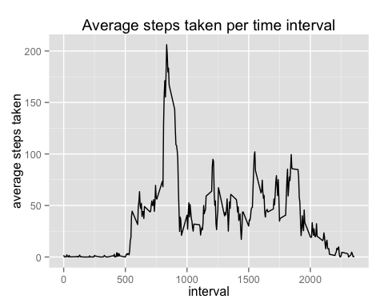

# Reproducible Research: Peer Assessment 1

For this analysis we use the following libraries as dependencies and hence they have to be loaded into the environment.


```r
library(dplyr)
library(ggplot2)
```

## Loading and preprocessing the data

Load the data from the provided zip file:


```r
conn <- unz("activity.zip", filename = "activity.csv")
activity_data <- tbl_df(read.csv(conn, colClasses = c("integer", "Date", "integer")))
```

## What is mean total number of steps taken per day?

First, we want to summarize the data and compute the total number of steps made in each day of the measurement period. 


```r
daily_steps <- activity_data %>%
    group_by(date) %>% 
    summarise(steps = sum(steps, na.rm = T))
```

Next, let's take a look at the distribution of the daily number of steps:


```r
with(daily_steps, hist(steps, breaks=max(steps) / 1000))
```

 

And finally, let's see what are the mean and median total number of steps taken each day.


```r
with(daily_steps,
     list(mean = mean(steps),
          median = median(steps)))
```

```
## $mean
## [1] 9354.23
## 
## $median
## [1] 10395
```

## What is the average daily activity pattern?

In order to visualize the average daily activity pattern, we need to summarise the data and compute the average of steps taken within each time interval across all the days.


```r
activity_pattern <- activity_data %>%
    group_by(interval) %>% 
    summarise(avg_steps = mean(steps, na.rm = T))
```

Next, we need to plot the results.


```r
ggplot(mapping = aes(x = interval, y = avg_steps), data=activity_pattern) + 
    geom_line() +
    labs(title="Average steps taken per time interval", y = "average steps taken")
```

 

## Imputing missing values


## Are there differences in activity patterns between weekdays and weekends?
